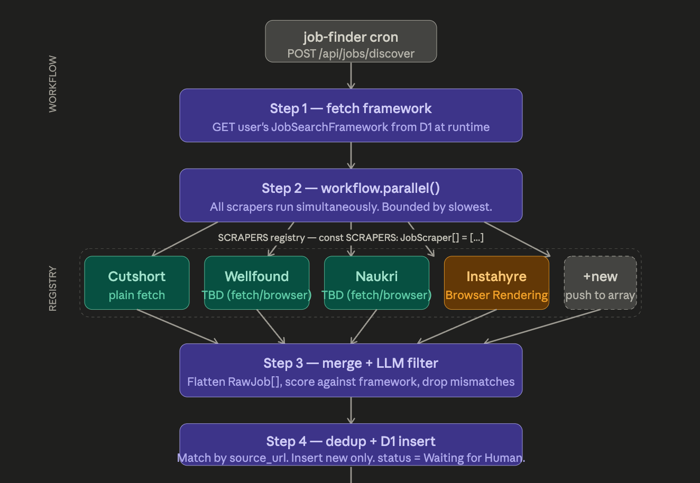

The architecture has three distinct layers — the interface every scraper must implement, the registry that holds them all, and the Workflow that orchestrates them. Here's the full plan:Here's the complete architecture, layer by layer.

---

**Layer 1 — The contract (the only thing that matters for isolation)**

Every scraper implements one interface. The workflow never knows which scrapers exist — it only calls `scrape()` and gets back `RawJob[]`. That's the entire coupling surface.

```ts
interface JobScraper {
  source: string;
  scrape(framework: JobSearchFramework): Promise<RawJob[]>;
}

type RawJob = {
  title: string;
  company: string;
  location: string;
  salary?: string;
  jd_text: string;
  source_url: string; // dedup key — must be stable and unique per listing
  source: string; // "cutshort" | "instahyre" etc.
};
```

**Layer 2 — The registry**

One flat array. Adding a new scraper = instantiate a class, push to the array. Zero changes anywhere else.

```ts
// scrapers/index.ts
import { CutshortScraper } from "./cutshort";
import { InstahyreScraper } from "./instahyre";

export const SCRAPERS: JobScraper[] = [
  new CutshortScraper(),
  new InstahyreScraper(),
  // new WellfoundScraper(),  ← one line to add
];
```

**Layer 3 — How scrapers stay isolated from each other**

Each scraper lives in its own file and owns its own logic entirely:

```

```
